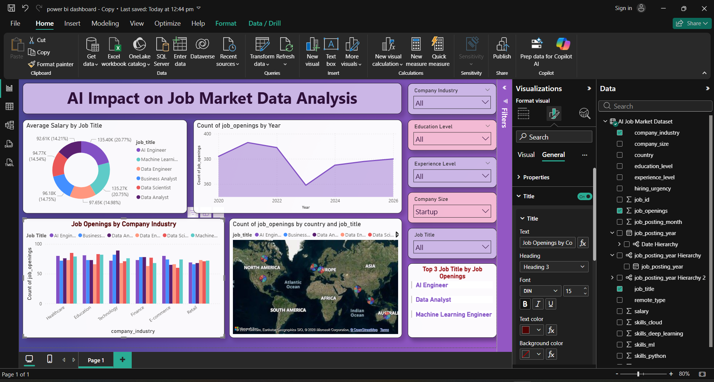

<!DOCTYPE html>
<html lang="en">
<head>
<meta charset="UTF-8">
<meta name="viewport" content="width=device-width, initial-scale=1.0">
<title>AI Impact on Job Market Dashboard</title>

</head>

<body>

<h1>AI Impact on Job Market Data Analysis Dashboard</h1>

This project presents an interactive dashboard built using 
<strong>Power BI</strong> to analyze the impact of Artificial Intelligence on 
the global job market. The dashboard provides insights into salary trends, 
job demand, industry hiring patterns, and geographical distribution of AI jobs.

<h2>Project Objective</h2>

The main goal of this project is to explore how Artificial Intelligence is 
influencing employment opportunities in data-related fields. It helps users 
understand which roles are most in demand, how salaries vary across job titles, 
and which industries are actively hiring AI professionals.

<h2>Dataset Description</h2>

The dataset used in this project includes multiple attributes related to 
AI job postings such as job titles, salary, industry, country, company size, 
experience level, and required skills like Python and Machine Learning.

<h2>Dashboard Features</h2>

<ul>
<li>Average Salary Distribution by Job Title</li>
<li>Job Openings Trend Over Time</li>
<li>Industry-wise Hiring Analysis</li>
<li>Global Job Distribution Map</li>
<li>Top 3 Most Demanded Job Roles</li>
<li>Interactive Filters for Industry, Experience, and Education</li>
</ul>

<h2>Dashboard Overview</h2>

<h2>Tools & Technologies Used</h2>

<h2>Key Insights</h2>

<ul>
<li>AI-related job roles are growing rapidly worldwide.</li>
<li>AI Engineers and Machine Learning Engineers receive the highest salaries.</li>
<li>Technology and finance industries show the highest demand for AI professionals.</li>
<li>Global demand for AI talent is increasing across multiple regions.</li>
</ul>

<h2>Conclusion</h2>

This dashboard demonstrates how data visualization tools can be used to 
analyze trends in the AI job market. It provides meaningful insights for 
students, job seekers, and organizations to understand emerging opportunities 
in the field of Artificial Intelligence and data analytics.

Created for Data Analysis and Visualization Project

</body>
</html>
